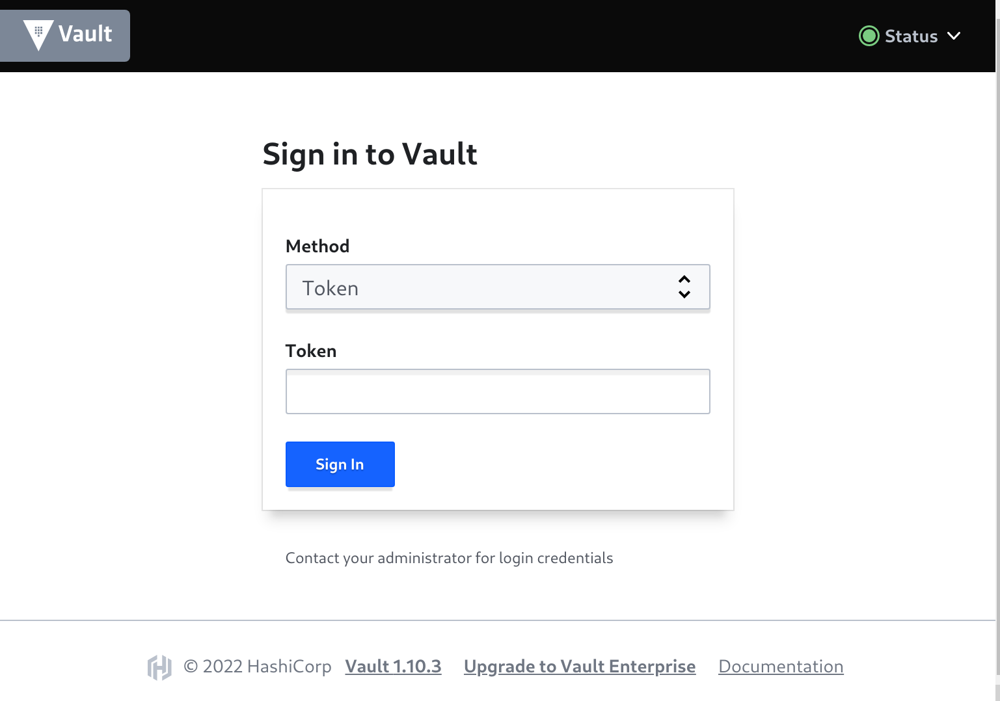
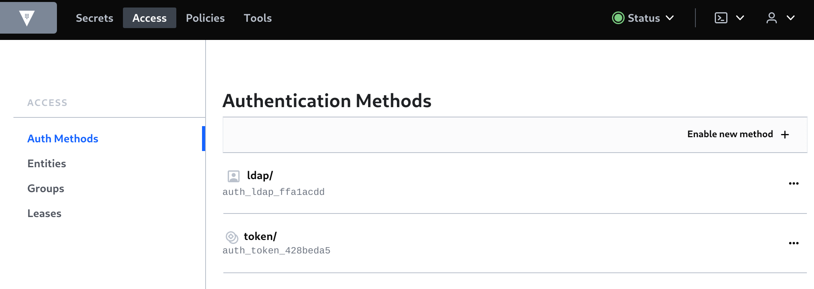
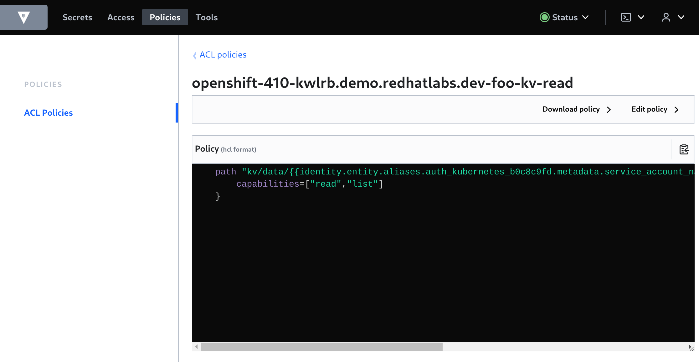
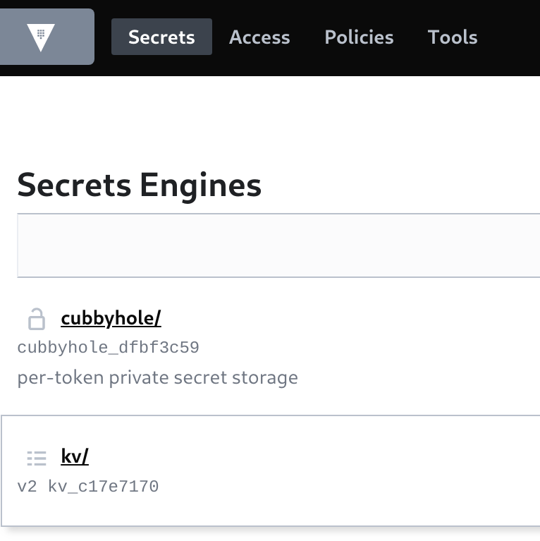

# Vault Configuration

## Namespace and Mount Structuring Guide

<p class="tip">
⛷️ <b>TIP</b> ⛷️ - Skip the background reading if you want, but at some point you will need it !
</p>  

For this demo, there are a few [recommended patterns](https://learn.hashicorp.com/tutorials/vault/namespace-structure?in=vault/recommended-patterns) and background reading on [ACL Policy templating](https://learn.hashicorp.com/tutorials/vault/policy-templating) that should be considered a MUST read. In particular watch the [Youtube Video](https://www.youtube.com/watch?v=zDnIqSB4tyA&t=1532s). Also checkout the [References](#references) links.

We will:

- setup vault self-service where team users can manage their own key values on a per team/application basis
- leverage Vault identities and vault ACL templates for ensuring that apps can only read their own secrets
- we do not use vault namespaces (they are an enterprise feature)
- deploy an app and connect it to vault with using an app k8s service-account
- app k8s service-account can read, list secrets for that app only using ACL's
- users in the team group has full access to their team secrets
- admins must configure
    - project, vault policy
- team users can configure
    - app secrets, app service accounts, vault config for these

Everything in vault is path based.  The Paths we setup in vault are as follows.

```bash
== Access ==
ldap/                                   <-- ldap users in $TEAM_GROUP
token/                                  <-- default, token
$BASE_DOMAIN-$PROJECT_NAME/$APP_NAME    <-- kubernetes roles by cluster-project/app

== Groups ==
$TEAM_GROUP/                            <-- ldap entity ids (users) for $TEAM_GROUP

== Secrets ==
kv/                                     <-- kv version 2
kv/$TEAM_GROUP                          <-- team group secrets
kv/$TEAM_GROUP/$PROJECT_NAME            <-- project secrets
kv/$TEAM_GROUP/$PROJECT_NAME/$APP_NAME  <-- app secrets kvv2

== Policies ==
$TEAM_GROUP_$APP_NAME/              <-- users in $TEAM_GROUP CRUDL on kv/TEAM_GROUP
                                    <-- k8s app sa auth/$BASE_DOMAIN-$PROJECT_NAME CRUDL

$BASE_DOMAIN-$PROJECT_NAME-kv-read  <-- k8s app sa RL on kv/$TEAM_GROUP/$PROJECT_NAME/$APP_NAME

Notes: CRUDL = create, read, update, delete, list
```

## Login and check vault

Login to vault using the environment vars and token.

```bash
vault login token=${ROOT_TOKEN}
```

If all is OK, you should see.

<pre>
Success! You are now authenticated. The token information displayed below
is already stored in the token helper. You do NOT need to run "vault login"
again. Future Vault requests will automatically use this token.

Key                  Value
---                  -----
token                this-is-not-my-token
token_accessor       this-is-not-my-token-accessor
token_duration       ∞
token_renewable      false
token_policies       ["root"]
identity_policies    []
policies             ["root"]
</pre>

We can check vault quorum is OK.

```bash
vault operator raft list-peers
```
<pre>
Node       Address                        State       Voter
----       -------                        -----       -----
vault-0    vault-0.vault-internal:8201    leader      true
vault-1    vault-1.vault-internal:8201    follower    true
vault-2    vault-2.vault-internal:8201    follower    true
</pre>

If you browse to the Web UI you should be able to login using your token as well.



## Team based access

There are [many](https://www.vaultproject.io/api-docs/auth/userpass) authentication methods supported by vault.

We use the [FreeIPA](https://github.com/redhat-cop/helm-charts/tree/master/charts/ipa) helm chart in our OpenShift cluster to [provision users](https://docs.openshift.com/container-platform/4.10/authentication/identity_providers/configuring-ldap-identity-provider.html).

We will leave this as an exercise for the user to configure in your own cluster and I will leave this [automation breadcrumb trail](https://github.com/redhat-cop/agnosticd/blob/development/ansible/roles_ocp_workloads/ocp4_workload_tl500/tasks/workload.yml) and helm chart hint to get you going:

```bash
helm upgrade --install ipa redhat-cop/ipa --namespace=ipa \
  --create-namespace --set app_domain={{ apps_domain }} \
  --set admin_password={{ ldap_admin_password | quote }} \
  --set ocp_auth.enabled=true \
  --set ocp_auth.bind_password={{ ldap_admin_password | quote }} \
  --set ocp_auth.bind_dn={{ bind_dn | quote }} --timeout=45m
```

### LDAP

We can easily configure vault to authenticate with LDAP. Export our `binddn` user password.

```bash
export LDAP_BIND_PASSWORD=this-is-not-my-password
```

Change `dn`'s to suit your ldap configuration, enable auth login for vault.

```bash
vault auth enable ldap
```
```bash
vault write auth/ldap/config \
  url="ldap://ipa.ipa.svc.cluster.local:389" \
  binddn="uid=ldap_admin,cn=users,cn=accounts,dc=redhatlabs,dc=com" \
  bindpass="$LDAP_BIND_PASSWORD" \
  userdn="cn=users,cn=accounts,dc=redhatlabs,dc=com" \
  userattr="uid" \
  groupdn="cn=student,cn=groups,cn=accounts,dc=redhatlabs,dc=com" \
  groupattr="cn"
```

If you login to vault from the Web UI you should see this Access > Auth Methods > `ldap` auth method.



We can now try ldap using a regular user (`mike`). Our user `mike` is part of the `student` group in LDAP.

```bash
vault login -method=ldap username=mike
```

If all is OK, you should see.

<pre>
Password (will be hidden): 
Success! You are now authenticated. The token information displayed below
is already stored in the token helper. You do NOT need to run "vault login"
again. Future Vault requests will automatically use this token.

Key                    Value
---                    -----
token                  this-is-not-mikes-token
token_accessor         this-is-not-mikes-token-accessor
token_duration         768h
token_renewable        true
token_policies         ["default"]
identity_policies      []
policies               ["default"]
token_meta_username    mike
</pre>

## Team Setup

### Admin

We have a team name and group configured in LDAP. RBAC within OpenShift is configured against this group. We will use this same group name in our vault configuration and setup.

As a `cluster-admin` we are going to create and configure the team project and vault policies. This sort of on-boarding workflow is pretty common and often automated for OpenShift clusters.

Provision a team namespace.  The $TEAM_GROUP needs to match the LDAP `groupdn` from above i.e. it is `student`.

```bash
export TEAM_NAME=foo
export TEAM_GROUP=student
export PROJECT_NAME=${TEAM_NAME}-apps
```
```bash
oc new-project ${PROJECT_NAME}
```

Bind out team via the team group so they are project `admin`'s.

```bash
cat <<EOF | oc apply -f-
kind: RoleBinding
apiVersion: rbac.authorization.k8s.io/v1
metadata:
  name: ${TEAM_GROUP}-admin
  namespace: ${PROJECT_NAME}
subjects:
  - kind: Group
    apiGroup: rbac.authorization.k8s.io
    name: ${TEAM_GROUP}
roleRef:
  apiGroup: rbac.authorization.k8s.io
  kind: ClusterRole
  name: admin
EOF
```

We need to give the application that our team will deploy a k8s service account that has permissions to authenticate to vault using the k8s authentication mechanism. This is a privileged action otherwise we could have let the user do it.

```bash
export APP_NAME=vault-quickstart
```
```bash
oc -n ${PROJECT_NAME} create sa ${APP_NAME}
oc adm policy add-cluster-role-to-user system:auth-delegator -z ${APP_NAME} -n ${PROJECT_NAME}
```

Now we can login to vault and create the ACL policy. There are two parts to the policy. 

The first path in our policy uses an `ACL template`. This allows team users who are part of the $TEAM_GROUP (`student` in our case) to create `key-values` aka secrets, under the project specific path. The template is a type of membership check as the user must be part of the `student` group for them to CRUDL under this `kv/` path.

The second path in our policy allows CRUDL access for `auth/` under $BASE_DOMAIN-$PROJECT_NAME. We use this to create k8s `config` that the application service account use to authenticate to vault. This is `cluster-project` specific hence the ath name.

```bash
vault login token=${ROOT_TOKEN}
```
```bash
vault policy write $TEAM_GROUP-$PROJECT_NAME -<<EOF
path "kv/data/{{identity.groups.names.$TEAM_GROUP.name}}/$PROJECT_NAME/*" {
    capabilities = [ "create", "update", "read", "delete", "list" ]
}
path "auth/$BASE_DOMAIN-$PROJECT_NAME/*" {
    capabilities = [ "create", "update", "read", "delete", "list" ]
}
EOF
```


Next we can create the `identity/group` in vault that matches our LDAP team group.

We need our list of user ID's to attach to the group. The Web UI makes this easy, but its hard from the CLI. Luckily we only have the one identity entity from our previous `mike` ldap login.

```bash
vault list identity/entity/id
```
<pre>
Keys
----
465ea512-80b4-ee7a-4ff2-b992149140b0
</pre>

We need this and our $TEAM_GROUP-$PROJECT_NAME policy to add to our group in vault. The parameters `policies` and  `member_entity_ids` are *lists* so if we have multiple team members and projects we can include them and/or update this when needed.

```bash
vault write identity/group name="$TEAM_GROUP" \
     policies="$TEAM_GROUP-$PROJECT_NAME" \
     member_entity_ids=465ea512-80b4-ee7a-4ff2-b992149140b0 \
     metadata=team="$TEAM_GROUP"
```

We need to enable k8s based authentication in vault. We create it using a path based on the `cluster-project` we used in the policy above. Run the following commands.

```bash
vault auth enable -path=$BASE_DOMAIN-${PROJECT_NAME} kubernetes
vault auth list
```

To allow our application service account to read and list (RL) secrets, we use another ACL template for `kv/` that uses the k8s auth accessor in the path. The application service account can therefore only RL secrets that match its name and namespace in the path.  

```bash
export MOUNT_ACCESSOR=$(vault auth list -format=json | jq -r ".\"$BASE_DOMAIN-$PROJECT_NAME/\".accessor")
```
```bash
vault policy write $BASE_DOMAIN-$PROJECT_NAME-kv-read -<< EOF
    path "kv/data/$TEAM_GROUP/{{identity.entity.aliases.$MOUNT_ACCESSOR.metadata.service_account_namespace}}/{{identity.entity.aliases.$MOUNT_ACCESSOR.metadata.service_account_name}}" {
        capabilities=["read","list"]
    }
EOF
```
```bash
vault policy read $BASE_DOMAIN-$PROJECT_NAME-kv-read
```



Lastly, as `root` we need to enable the KVV2 secrets engine (not to be confused with a V1 kv engine).

```bash
vault secrets enable -path=kv/ -version=2 kv
```



### Non-Admin

We can now create our vault config as our `student` team user `mike`.  Login to vault and OpenShift.

```bash
oc login --server=https://api.${BASE_DOMAIN}:6443 -u mike
```
```bash
vault login -method=ldap username=mike
```

We should see the policy created by admin above.

<pre>
Key                    Value
---                    -----
token                  this-is-not-mikes-token
token_accessor         this-is-not-mikes-token-accessor
token_duration         768h
token_renewable        true
token_policies         ["default"]
identity_policies      ["student-foo-apps"]
policies               ["default" "student-foo-apps"]
token_meta_username    mike
</pre>

Let's create the $APP_NAME based auth role.

```bash
vault write auth/$BASE_DOMAIN-$PROJECT_NAME/role/$APP_NAME \
  bound_service_account_names=$APP_NAME \
  bound_service_account_namespaces=$PROJECT_NAME \
  policies=$BASE_DOMAIN-$PROJECT_NAME-kv-read \
  period=120s
```

We need to create the auth config that allows the service account token to be used to do a k8s based login to vault. Lets get the service account token and ca cert.

```bash
export SA_TOKEN=$(oc -n ${PROJECT_NAME} get sa/${APP_NAME} -o yaml | grep ${APP_NAME}-token | awk '{print $3}')
export SA_JWT_TOKEN=$(oc -n ${PROJECT_NAME} get secret $SA_TOKEN -o jsonpath="{.data.token}" | base64 --decode; echo)
export SA_CA_CRT=$(oc -n ${PROJECT_NAME} get secret $SA_TOKEN -o jsonpath="{.data['ca\.crt']}" | base64 --decode; echo)
```

We can create the auth config using these.

```bash
vault write auth/$BASE_DOMAIN-${PROJECT_NAME}/config \
  token_reviewer_jwt="$SA_JWT_TOKEN" \
  kubernetes_host="$(oc whoami --show-server)" \
  kubernetes_ca_cert="$SA_CA_CRT"
```

We need some KV data for our application to read. Let's create some.

```bash
vault kv put kv/$TEAM_GROUP/$PROJECT_NAME/$APP_NAME \
  app=$APP_NAME \
  username=foo \
  password=bar 
```

Which we can check.

```bash
vault kv get kv/$TEAM_GROUP/$PROJECT_NAME/$APP_NAME
```
<pre>
============== Secret Path ==============
kv/data/student/foo-apps/vault-quickstart

======= Metadata =======
Key                Value
---                -----
created_time       2022-05-26T09:56:02.897208905Z
custom_metadata    <nil>
deletion_time      n/a
destroyed          false
version            1

====== Data ======
Key         Value
---         -----
app         vault-quickstart
password    bar
username    foo
</pre>

Time to test out our application.
