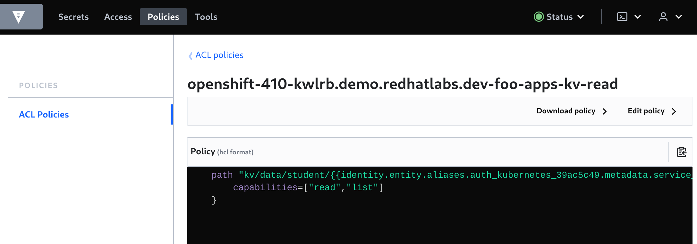

# Vault Configuration

## Namespace and Mount Structuring Guide

<p class="tip">
⛷️ <b>TIP</b> ⛷️ - Skip the background reading if you want, but at some point you will need it !
</p>  

For this demo, there are a few [recommended patterns](https://learn.hashicorp.com/tutorials/vault/namespace-structure?in=vault/recommended-patterns) and background reading on [ACL Policy templating](https://learn.hashicorp.com/tutorials/vault/policy-templating) that should be considered a MUST read. In particular watch the [Youtube Video](https://www.youtube.com/watch?v=zDnIqSB4tyA&t=1532s). Also checkout the [References](#references) links.

We will:

- setup vault self-service where team users can manage their own KV per team/application
- leverage Vault identities, vault ACL templates for ensuring apps can only read their own secrets
- not use vault namespaces (they are an enterprise feature)
- deploy an app and connect to vault with an application k8s service-account
- application k8s service-account can read, list secrets for that app only using ACL's
- users in the team group has full access to their team secrets
- admins must configure
    - project, vault policy
- team users can configure
    - app secrets, app service accounts, vault config for these

Paths in vault:

```bash
== Access ==
ldap/                                   <-- ldap users in $TEAM_GROUP
token/                                  <-- default, token
$BASE_DOMAIN-$PROJECT_NAME/$APP_NAME    <-- kubernetes roles by cluster-project/app

== Groups ==
$TEAM_GROUP/                            <-- ldap entity ids (users) for $TEAM_GROUP

== Secrets ==
kv/                                     <-- kv version 2
kv/$TEAM_GROUP                          <-- team group secrets
kv/$TEAM_GROUP/$PROJECT_NAME            <-- project secrets
kv/$TEAM_GROUP/$PROJECT_NAME/$APP_NAME  <-- app secrets kvv2

== Policies ==
$TEAM_GROUP_$APP_NAME/              <-- users in $TEAM_GROUP CRUDL on kv/TEAM_GROUP
                                    <-- k8s app sa auth/$BASE_DOMAIN-$PROJECT_NAME CRUDL

$BASE_DOMAIN-$PROJECT_NAME-kv-read  <-- k8s app sa RL on kv/$TEAM_GROUP/$PROJECT_NAME/$APP_NAME

Notes: CRUDL = create, read, update, delete, list
```

## Login and check vault

Login to vault using the environment vars and token.

```
vault login token=${ROOT_TOKEN}
```

If all OK, you should see.

```bash
Success! You are now authenticated. The token information displayed below
is already stored in the token helper. You do NOT need to run "vault login"
again. Future Vault requests will automatically use this token.

Key                  Value
---                  -----
token                this-is-not-my-token
token_accessor       this-is-not-my-token-accessor
token_duration       ∞
token_renewable      false
token_policies       ["root"]
identity_policies    []
policies             ["root"]
```

We can check vault quorum is OK.

```bash
$ vault operator raft list-peers

Node       Address                        State       Voter
----       -------                        -----       -----
vault-0    vault-0.vault-internal:8201    leader      true
vault-1    vault-1.vault-internal:8201    follower    true
vault-2    vault-2.vault-internal:8201    follower    true
```

If you browse to the Web UI you should be able to login using your token as well.


## Team based access

There are [many](https://www.vaultproject.io/api-docs/auth/userpass) auth methods supported by vault.

You can continue using the `root` token or setup `userpass` if you do not have LDAP in your cluster.

- [ldap](https://www.vaultproject.io/api-docs/auth/ldap)
- [userpass](https://www.vaultproject.io/api-docs/auth/userpass)

### LDAP

We have LDAP configured for users in our OpenShift cluster. We can easily configure this to authenticate with vault. Export our `bindDN` user password.

```bash
export LDAP_PASSWORD=this-is-not-my-password
```

Change `dn`'s to suit your ldap configuration, enable auth login for vault.

```bash
vault auth enable ldap

vault write auth/ldap/config \
  url="ldap://ipa.ipa.svc.cluster.local:389" \
  binddn="uid=ldap_admin,cn=users,cn=accounts,dc=redhatlabs,dc=com" \
  bindpass="$LDAP_PASSWORD" \
  userdn="cn=users,cn=accounts,dc=redhatlabs,dc=com" \
  userattr="uid" \
  groupdn="cn=student,cn=groups,cn=accounts,dc=redhatlabs,dc=com" \
  groupattr="cn"
```

If you login to vault from the Web UI you should see this Access > Auth Methods > `ldap` auth method.


We can now try ldap using a regular user.

```bash
vault login -method=ldap username=mike
```

If all is OK, you should see.

```bash
Password (will be hidden): 
Success! You are now authenticated. The token information displayed below
is already stored in the token helper. You do NOT need to run "vault login"
again. Future Vault requests will automatically use this token.

Key                    Value
---                    -----
token                  this-is-not-mikes-token
token_accessor         this-is-not-mikes-token-accessor
token_duration         768h
token_renewable        true
token_policies         ["default"]
identity_policies      []
policies               ["default"]
token_meta_username    mike
```

### Userpass

FIXME - add userpass instructions

## Team Setup

### Admin

```bash
export TEAM_NAME=bar
export TEAM_GROUP=student
export PROJECT_NAME=${TEAM_NAME}

oc new-project ${PROJECT_NAME}

cat <<EOF | oc apply -f-
kind: RoleBinding
apiVersion: rbac.authorization.k8s.io/v1
metadata:
  name: ${TEAM_GROUP}-admin
  namespace: ${PROJECT_NAME}
subjects:
  - kind: Group
    apiGroup: rbac.authorization.k8s.io
    name: ${TEAM_GROUP}
roleRef:
  apiGroup: rbac.authorization.k8s.io
  kind: ClusterRole
  name: admin
EOF

oc adm policy add-cluster-role-to-user system:auth-delegator -z ${APP_NAME} -n ${PROJECT_NAME}

vault login token=${ROOT_TOKEN}

vault policy write $TEAM_GROUP-$PROJECT_NAME -<<EOF
path "kv/data/{{identity.groups.names.$TEAM_GROUP.name}}/$PROJECT_NAME/*" {
    capabilities = [ "create", "update", "read", "delete", "list" ]
}
path "auth/$BASE_DOMAIN-$PROJECT_NAME/*" {
    capabilities = [ "create", "update", "read", "delete", "list" ]
}
EOF

# these are lists policies, member_entity_ids 
vault write identity/group name="$TEAM_GROUP" \
     policies="student_foo,$TEAM_GROUP-$PROJECT_NAME" \
     member_entity_ids=77b3550d-d610-afe2-e24a-588923b7a8b8 \
     metadata=team="$TEAM_GROUP"
     
vault secrets enable -path=kv/ -version=2 kv
vault auth enable -path=$BASE_DOMAIN-${PROJECT_NAME} kubernetes

vault auth list
export MOUNT_ACCESSOR=$(vault auth list -format=json | jq -r ".\"$BASE_DOMAIN-$PROJECT_NAME/\".accessor")

vault policy write $BASE_DOMAIN-$PROJECT_NAME-kv-read - << EOF
    path "kv/data/$TEAM_GROUP/{{identity.entity.aliases.$MOUNT_ACCESSOR.metadata.service_account_namespace}}/{{identity.entity.aliases.$MOUNT_ACCESSOR.metadata.service_account_name}}" {
        capabilities=["read","list"]
    }
EOF

vault policy read $BASE_DOMAIN-$PROJECT_NAME-kv-read
```



### Non-Admin

```bash
export APP_NAME=vault-quickstart

oc login --server=https://api.${BASE_DOMAIN}:6443 -u mike
vault login -method=ldap username=mike

vault write auth/$BASE_DOMAIN-$PROJECT_NAME/role/$APP_NAME \
  bound_service_account_names=$APP_NAME \
  bound_service_account_namespaces=$PROJECT_NAME \
  policies=$BASE_DOMAIN-$PROJECT_NAME-kv-read \
  period=120s

vault kv put kv/$TEAM_GROUP/$PROJECT_NAME/$APP_NAME \
  app=$APP_NAME \
  username=foo \
  password=baz
  
vault kv get kv/$TEAM_GROUP/$PROJECT_NAME/$APP_NAME
```
