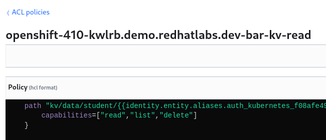

# Application

## Build

```bash
mvn package -Dquarkus.package.type=fast-jar -DskipTests
```

## Deploy

```bash
mvn oc:build oc:resource oc:apply \
 -Djkube.namespace=$PROJECT_NAME \
 -Dbase.domain=$BASE_DOMAIN
```

```bash
export SA_TOKEN=$(oc -n ${PROJECT_NAME} get sa/${APP_NAME} -o yaml | grep ${APP_NAME}-token | awk '{print $3}')
export SA_JWT_TOKEN=$(oc -n ${PROJECT_NAME} get secret $SA_TOKEN -o jsonpath="{.data.token}" | base64 --decode; echo)
export SA_CA_CRT=$(oc -n ${PROJECT_NAME} get secret $SA_TOKEN -o jsonpath="{.data['ca\.crt']}" | base64 --decode; echo)
vault write auth/$BASE_DOMAIN-${PROJECT_NAME}/config \
  token_reviewer_jwt="$SA_JWT_TOKEN" \
  kubernetes_host="$(oc whoami --show-server)" \
  kubernetes_ca_cert="$SA_CA_CRT"
```

## Test

V1 Secret

```bash
curl -sk -w"\n" https://$(oc get route $APP_NAME --template='{{ .spec.host }}')/kv/$TEAM_GROUP/$PROJECT_NAME/$APP_NAME

{app=vault-quickstart, password=bar, username=foo}
```

V2 Secret

```bash
vault kv put kv/$TEAM_GROUP/$PROJECT_NAME/$APP_NAME \
  app=$APP_NAME \
  username=cab \
  password=abc

curl -sk -w"\n" https://$(oc get route $APP_NAME --template='{{ .spec.host }}')/kv/$TEAM_GROUP/$PROJECT_NAME/$APP_NAME

{app=vault-quickstart, password=abc, username=cab}
```

Lookup another application's secret (Not Allowed)

```bash
oc login --server=https://api.${BASE_DOMAIN}:6443 -u mike
vault login -method=ldap username=mike
vault token lookup

export APP_NAME=another-app

vault kv put kv/$TEAM_GROUP/$PROJECT_NAME/$APP_NAME \
  app=$APP_NAME \
  username=cab \
  password=abc

curl -sk -w"\n" https://$(oc get route vault-quickstart --template='{{ .spec.host }}')/kv/$TEAM_GROUP/$PROJECT_NAME/$APP_NAME

# k8s app sa can only get secrets at kv/student/foo/vault-quickstart
# due to vault ACL policy
{"details":"Error id d47c2c4c-0893-4652-b2bd-f9dcb0ab8dfe-2","stack":""}
Caused by: io.quarkus.vault.runtime.client.VaultClientException code=403 body={"errors":["1 error occurred:\n\t* permission denied\n\n"]}

export APP_NAME=vault-quickstart
curl -sk -w"\n" https://$(oc get route $APP_NAME --template='{{ .spec.host }}')/kv/$TEAM_GROUP/$PROJECT_NAME/$APP_NAME

{app=vault-quickstart, password=bar, username=foo}
```

Delete a secret (Not Allowed) ACL policy denies this to the app sa

```bash
curl -X DELETE -sk -w"\n" https://$(oc get route $APP_NAME --template='{{ .spec.host }}')/kv/$TEAM_GROUP/$PROJECT_NAME/$APP_NAME

{"details":"Error id cb28d8e2-4ff2-4a14-b110-884489b36e00-2","stack":""}
```

We could update the $BASE_DOMAIN-$PROJECT_NAME-kv-read policy with "delete" just to make sure



```bash
capabilities=["read","list","delete"]

curl -X DELETE -sk -w"\n" https://$(oc get route $APP_NAME --template='{{ .spec.host }}')/kv/$TEAM_GROUP/$PROJECT_NAME/$APP_NAME

Secret: student/bar/vault-quickstart deleted
```

